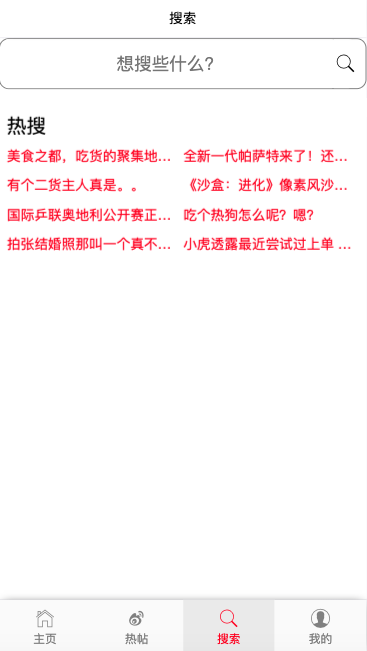
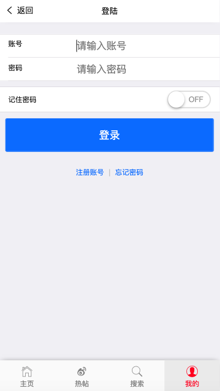
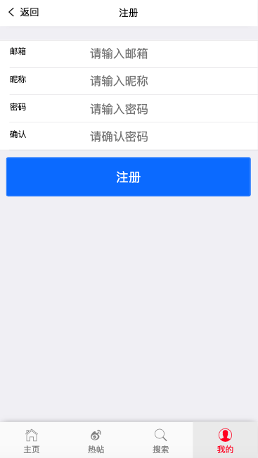
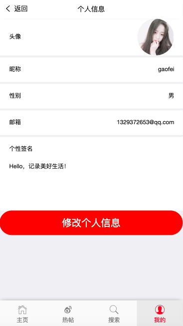
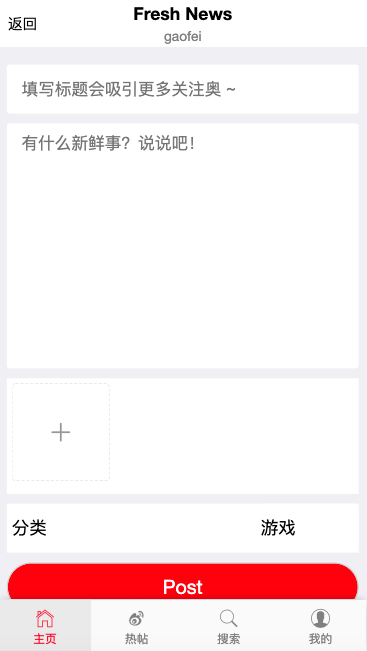
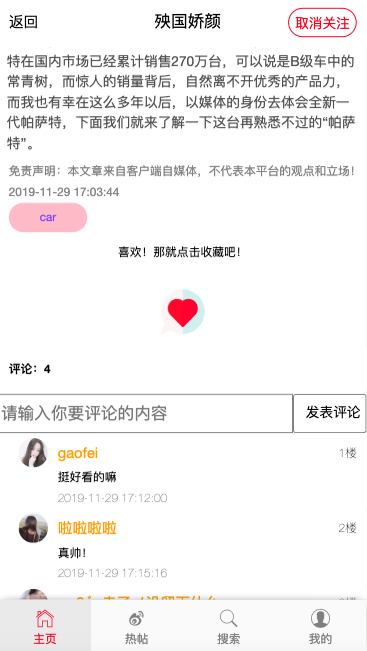

# Supra-forum

## 1.说明：

​		使用vue框架搭建的一个Webapp论坛项目，麻雀虽小，五脏俱全，适合vue的入门学习。

​		如果对您有帮助请点击右上角的“star”支持一下！谢谢！ ^_^，如果项目存在哪些问题，请联系我进行更正哦！

## 2.项目运行：

```
#克隆整个项目到本地：
		git clone https://github.com/1329372653/Supra-forum.git
#安装MongoDB数据库：
		安装步骤不一一介绍，不懂的自行查阅，谢谢！
#导入MongoDB数据（论坛的一些用于展示的数据）：
		打开MongoDB-data文件夹，里面有个文件forumProject.js，将此文件的数据导入到MongoDB数据库即可。
#开启MongoDB服务：
		Mac系统在终端输入：sudo mongod命令，输入电脑密码即可开启服务。（Windows系统不再介绍）
#进入后台Supra-forum-server文件夹:
		cd Supra-forum-server
#安装依赖：
		npm install
#开启本地服务器localhost:8899
		node node sever.js
#进入前台Supra-forum文件夹：
		cd Supra-forum
#安装依赖：
		npm install
#开启本地服务localhost:3000
		npm run serve
#发布环境：
		npm run build

```

## 3.效果演示：

下面展示本项目的一些主要页面，还有一些页面尚未展示，更多信息请自行下载体验哦！！！

### 首页


### 热门帖子


### 搜索页面



### 我的页面

.png)


#### 登录界面





#### 个人信息



#### 修改个人信息


### 发布页面



### 帖子详情页面


### 评论界面



## 4.项目功能介绍

本项目主要实现了以下功能：

```
#用户的注册
#用户登录以及退出登录
#用户个人信息查询
#用户个人信息修改
#用户密码修改
#帖子的发布
#根据分类展示帖子
#帖子的收藏与取消收藏
#用户的关注与取消关注
#帖子的收藏数量，帖子的评论数，帖子的阅读量
#帖子详情展示
#评论以及删除评论
#热门帖子（根据帖子的阅读量排序）
#热门帖子上的轮播图（每次随机选择五个帖子进行公平展示）
#搜索功能（搜索帖子的标题）（热门搜索根据帖子的热度）
```

## 5.项目上线准备

本项目上线需要修改以下数据：

1.修改Supra-forum目录下的src/views/下的每个页面代码中的图片的src路径

```
比如：
修改为：
```

2.修改vue.config.js

```
将下面代码中的target目标服务器地址修改为：您的服务器地址
devServer: {
        open: true,
        host: '0.0.0.0',
        port: 3000,
        https: false,
        hotOnly: false,
        proxy: {
            //凡是请求以api开头的都会使用下面的代理服务器
            '/api/*': {
                target: 'http://127.0.0.1:8899/', // 目标服务器地址
                secure: false, // 目标服务器地址是否是安全协议
                changeOrigin: true, // 是否修改来源, 为true时会让目标服务器以为是webpack-dev-server发出的请求!服务端和服务端的请求是没有跨域的
                //pathRewrite: {'^/api': '/a'}     // 将/api开头的请求地址, /api 改为 /, 即 /api/xx 改为 /xx
            }
        }
    },
```

3.npm run build进行项目打包，生成dist文件夹

## 6.关注我的博客

https://1329372653.github.io

关注我的博客获取更多！